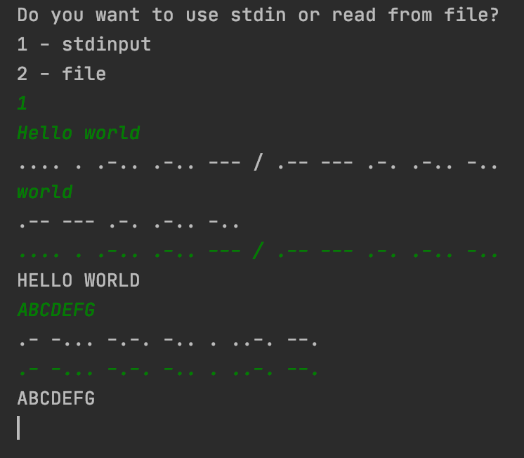

# morse
morse decoder

</img>

Photo by <a href="https://unsplash.com/@chriscurry92?utm_source=unsplash&amp;utm_medium=referral&amp;utm_content=creditCopyText">Chris Curry</a> on <a href="https://unsplash.com/s/photos/morse?utm_source=unsplash&amp;utm_medium=referral&amp;utm_content=creditCopyText">Unsplash</a>

## About

My morse program works with English alphabet letters and digits.

It reads from `fd`. Could be file or `stdin`.

## Install

`git clone https://github.com/kukinpower/morse.git`

`cd morse`

`git submodule update --init` to clone `libft` `get_next_line` `ft_printf`

## Compilation

`make main` to compile program.

`./morse` to run program.

`make` to compile only `morse.a` library to use `morse()` as you want.

Makefile works with rules: `re` `clean` `fclean` `main` `main clean`

Rule `main` compiles with `main.c`

Compiles with flags: `-Wall -Wextra -Werror -D BUFFER_SIZE=32`

`morse` uses `libft` library functions, `ft_printf()` and `get_next_line()`. And compiles with them.

[libft](https://github.com/kukinpower/libft)

[ft_printf](https://github.com/kukinpower/ft_printf)

[get_next_line](https://github.com/kukinpower/get_next_line)

## Use

</img>

To stop reading form `stdinput` simply write ` \ ` or any unsopported character in morse.

Author: [Roman Kukin](https://github.com/kukinpower/)